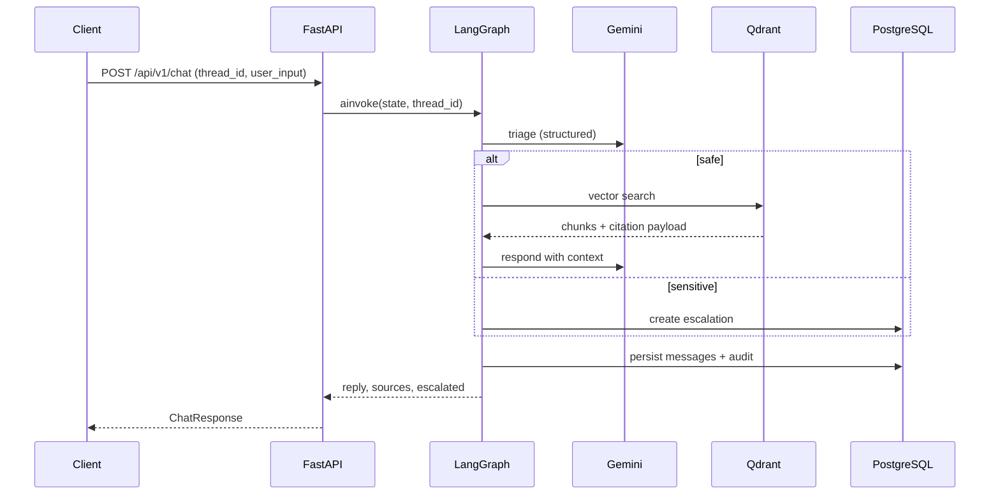

# Internal HR Policy Chatbot

FastAPI + LangGraph service that answers employee HR-policy questions with
retrieval-augmented generation (RAG), triages sensitive topics to human HR, and
persists an auditable trail in PostgreSQL.

Employees get policy-grounded answers without waiting on HR for routine
questions. Sensitive topics (harassment, termination, medical, etc.) are
escalated instead of answered automatically.

---

## Table of contents

1. [What it does](#what-it-does)
2. [Architecture](#architecture)
3. [Chat workflow](#chat-workflow)
4. [Document ingestion workflow](#document-ingestion-workflow)
5. [Escalation workflow](#escalation-workflow)
6. [Tech stack](#tech-stack)
7. [Requirements](#requirements)
8. [Quick start](#quick-start)
9. [Configuration](#configuration)
10. [Running the API](#running-the-api)
11. [API reference](#api-reference)
12. [Domain language](#domain-language)
13. [Project layout](#project-layout)
14. [Tests](#tests)
15. [Architecture decisions](#architecture-decisions)
16. [Operational notes](#operational-notes)

---

## What it does

| Capability | Description |
|---|---|
| Policy Q&A | Multi-turn chat grounded in indexed HR policy documents |
| Triage | Classifies each question into a closed policy category and sensitivity level |
| RAG | Retrieves relevant chunks from Qdrant (`gemini-embedding-2`, 768-d) |
| Escalation | Routes high-sensitivity / `needs_human` questions to an HR review queue |
| Audit trail | Persists conversations, messages, and structured decisions in PostgreSQL |
| Document admin | Upload / list / reindex PDF and Markdown policies |

Sample policies ship under `docs/policies/` (conduct, attendance, leave,
technology, HSE, compensation).

---

## Architecture

```
┌─────────────┐     x-api-key      ┌──────────────────────────────────────┐
│  Client /   │ ─────────────────► │  FastAPI  (/api/v1/*)                │
│  HR tools   │                    │  Chat · Documents · Escalations ·    │
└─────────────┘                    │  Conversations                       │
                                   └──────────────┬───────────────────────┘
                                                  │
                                   ┌──────────────▼───────────────────────┐
                                   │  LangGraph policy_chat workflow      │
                                   │  triage → retrieve|escalate → persist│
                                   └──────┬───────────────┬───────────────┘
                                          │               │
                    ┌─────────────────────▼──┐   ┌────────▼────────────┐
                    │  Google Gemini         │   │  PostgreSQL 16      │
                    │  Flash-Lite (triage /  │   │  users, conversations│
                    │  respond) + fallbacks  │   │  messages, docs,     │
                    │  gemini-embedding-2    │   │  escalations, audit  │
                    └───────────┬────────────┘   └─────────────────────┘
                                │
                    ┌───────────▼────────────┐
                    │  Qdrant                │
                    │  hr_policy_chunks      │
                    │  (+ citation payload)  │
                    └────────────────────────┘
```

**Embeddings use `gemini-embedding-2` (768-d Matryoshka vectors)**, not
`text-embedding-004`.

Short-term multi-turn memory uses a LangGraph checkpointer keyed by
`thread_id`. Long-term / reportable history lives in Postgres
(`conversations` + `messages`). See [ADR-004](docs/adr/0004-conversation-memory-checkpointer.md).

---

## Chat workflow

Every `POST /api/v1/chat` turn runs the same LangGraph path:

```
START
  │
  ▼
triage  (Gemini Flash-Lite + structured TriageResult)
  │
  ├── sensitivity ≠ high AND needs_human = false
  │     │
  │     ▼
  │   retrieve  (embed query → Qdrant top-k, score ≥ threshold)
  │     │
  │     ▼
  │   respond   (Gemini + YAML prompt + cited context)
  │     │
  │     ▼
  │   persist   (conversation + messages + audit)
  │     │
  │     ▼
  │    END
  │
  └── sensitivity = high OR needs_human = true
        │
        ▼
      escalate  (open ticket + safe refusal reply)
        │
        ▼
      persist
        │
        ▼
       END
```

### Node responsibilities

| Node | Role |
|---|---|
| **triage** | Closed-set category (`leave`, `benefits`, `remote_work`, `payroll`, `expenses`, `conduct`, `termination`, `medical`, `general`), sensitivity (`low` / `medium` / `high`), `needs_human`, confidence |
| **retrieve** | Embeds the question; pulls top-k chunks from Qdrant with payload metadata (filename, section, page) |
| **respond** | Grounds the reply in retrieved excerpts; returns `reply` + `sources` |
| **escalate** | Creates an open escalation; returns a fixed safe refusal (no automated advice on sensitive topics) |
| **persist** | Upserts user/conversation; writes Human + AI messages; records audit metadata |

### Multi-turn conversations

Reuse the same `thread_id` across requests so the checkpointer loads prior
turns. Persist always mirrors clean message text into Postgres for history /
audit (independent of checkpoint blobs — [ADR-001](docs/adr/0001-policy-responses-persisted-separately-from-checkpoints.md)).

### End-to-end sequence



---

## Document ingestion workflow

Used by `POST /api/v1/documents/upload`, `POST /api/v1/documents/reindex`,
and `scripts/seed_policies.py`.

```
PDF / Markdown / text
  │
  ▼
Docling parse  →  plain text
  │
  ▼
RecursiveCharacterTextSplitter  (CHUNK_SIZE / CHUNK_OVERLAP)
  │
  ▼
gemini-embedding-2  (EMBEDDING_DIMENSIONS=768)
  │
  ▼
Qdrant upsert  (payload: document_id, filename, section, page_number, …)
  +
Postgres  (policy_documents + document_chunks)
```

Supported upload extensions: `.pdf`, `.md`, `.markdown`, `.txt`.

Originals are stored under `data/uploads/` so reindex can rebuild vectors
without re-uploading.

---

## Escalation workflow

1. Triage marks the turn sensitive / needing a human.
2. Escalate node opens a row in `escalations` (`status=open`) and returns a
   safe refusal to the employee.
3. HR lists open cases via `GET /api/v1/escalations`.
4. HR closes a case via `POST /api/v1/escalations/{id}/resolve` with
   `resolved_by`.

---

## Tech stack

| Layer | Choice |
|---|---|
| API | FastAPI (Python 3.11+) |
| Orchestration | LangGraph StateGraph |
| LLMs | Google Gemini Flash-Lite (+ ordered fallbacks) |
| Embeddings | `gemini-embedding-2` (768-d) |
| Vector store | Qdrant (Cloud or local) |
| Relational DB | PostgreSQL 16 (SQLAlchemy async + Alembic) |
| Parsing | Docling |
| Package / runner | [uv](https://docs.astral.sh/uv/) |
| Observability (optional) | LangSmith |

---

## Requirements

- Python 3.11+
- [uv](https://docs.astral.sh/uv/)
- Docker (for local PostgreSQL; optional full stack)
- Google AI API key (`GOOGLE_API_KEY`)
- Qdrant Cloud **or** local Qdrant
- PostgreSQL 16

---

## Quick start

### 1. Install dependencies

```bash
uv sync
```

### 2. Configure environment

```bash
cp .env.example .env
```

Fill at least:

- `PROJECT_API_KEY` — shared key for `/api/v1/*`
- `GOOGLE_API_KEY`
- `QDRANT_URL` (and `QDRANT_API_KEY` if using Qdrant Cloud)

Defaults in `.env.example` already match the local Docker Postgres credentials.

### 3. Start PostgreSQL

```bash
docker compose up -d postgres
```

### 4. Run migrations

```bash
uv run alembic upgrade head
```

### 5. Seed sample policies (optional)

Indexes PDFs under `docs/policies/` into Postgres + Qdrant:

```bash
uv run python scripts/seed_policies.py
```

### 6. Start the API

```bash
uv run uvicorn hr_chatbot.main:app --reload
```

- Public: `GET /` and `GET /health`
- Authenticated API: `/api/v1/*` with header `x-api-key: <PROJECT_API_KEY>`
- Interactive docs: [http://localhost:8000/docs](http://localhost:8000/docs)

### Docker (API + Postgres)

With `.env` populated:

```bash
docker compose up --build
```

Qdrant is expected as Qdrant Cloud by default. To run Qdrant locally, uncomment
the `qdrant` service in `docker-compose.yml` and point `QDRANT_URL` at
`http://localhost:6333` (or `http://qdrant:6333` from the `api` container).

---

## Configuration

All settings load from `.env` via `hr_chatbot.core.config.Settings`.

| Variable | Purpose | Default / notes |
|---|---|---|
| `PROJECT_API_KEY` | Required `x-api-key` for `/api/v1` | — |
| `GOOGLE_API_KEY` | Gemini triage / respond / embeddings | — |
| `TRIAGE_MODEL` | Classification model | `gemini-3.1-flash-lite` |
| `RESPONSE_MODEL` | Answer generation model | `gemini-3.1-flash-lite` |
| `LLM_FALLBACK_MODELS` | Ordered fallbacks if primary fails | Flash-Lite variants |
| `EMBEDDING_MODEL` | Embedding model | `gemini-embedding-2` |
| `EMBEDDING_DIMENSIONS` | Vector size | `768` |
| `DATABASE_URL` | Async SQLAlchemy DSN | `postgresql+asyncpg://hr:hr@localhost:5432/hr_chatbot` |
| `DATABASE_URL_SYNC` | Sync DSN (Alembic / checkpointer) | `postgresql+psycopg://…` |
| `QDRANT_URL` | Vector DB URL | — |
| `QDRANT_API_KEY` | Qdrant Cloud key | optional for local |
| `QDRANT_COLLECTION` | Collection name | `hr_policy_chunks` |
| `CHUNK_SIZE` / `CHUNK_OVERLAP` | Ingest splitter | `2000` / `200` |
| `RETRIEVAL_TOP_K` | Chunks returned per query | `5` |
| `RETRIEVAL_SCORE_THRESHOLD` | Cosine floor | `0.45` |
| `LANGSMITH_*` | Optional tracing | off by default |
| `TORCHDYNAMO_DISABLE` etc. | Disable torch.compile for Docling on Windows | `1` |

Never commit real secrets. Keep `.env` local; use `.env.example` as the template.

---

## Running the API

```bash
# Local (recommended during development)
uv run uvicorn hr_chatbot.main:app --reload --host 0.0.0.0 --port 8000

# Production-style container
docker compose up --build api
```

Smoke checks:

```bash
curl http://localhost:8000/health
curl http://localhost:8000/
```

---

## API reference

All routes under `/api/v1` require:

```http
x-api-key: <PROJECT_API_KEY>
```

| Method | Path | Purpose |
|---|---|---|
| `POST` | `/api/v1/chat` | Ask a policy question (one graph turn) |
| `POST` | `/api/v1/documents/upload` | Upload + index PDF/Markdown/text |
| `GET` | `/api/v1/documents` | List indexed documents |
| `POST` | `/api/v1/documents/reindex` | Rebuild vectors (one doc or all) |
| `GET` | `/api/v1/conversations/{user_id}` | Conversation history for a user UUID |
| `GET` | `/api/v1/escalations` | List escalations (`?status=open` default) |
| `POST` | `/api/v1/escalations/{id}/resolve` | Mark escalation handled |

Legacy alias (hidden from OpenAPI): `POST /api/v1/policy-chat/chatbot` → same as `/chat`.

### Chat request / response

**Request**

```json
{
  "thread_id": "t1",
  "employee_id": "E001",
  "user_input": "How many sick days do I get?",
  "user_id": null
}
```

| Field | Required | Notes |
|---|---|---|
| `thread_id` | yes | Stable id for LangGraph memory across turns |
| `user_input` | yes | Employee question |
| `employee_id` | no | Defaults to `anonymous` |
| `user_id` | no | Optional known user UUID |

**Response**

```json
{
  "reply": "…",
  "sources": [{ "filename": "…", "section": "…", "page_number": 1, "score": 0.72 }],
  "escalated": false,
  "escalation_id": null,
  "triage": { "category": "leave", "sensitivity": "low", "needs_human": false, "confidence": 0.9 },
  "conversation_id": "…",
  "thread_id": "t1"
}
```

### Examples

**Ask a policy question**

```bash
curl -X POST http://localhost:8000/api/v1/chat \
  -H "x-api-key: changeme" \
  -H "Content-Type: application/json" \
  -d "{\"thread_id\":\"t1\",\"employee_id\":\"E001\",\"user_input\":\"How many sick days do I get?\"}"
```

**Follow-up in the same conversation**

```bash
curl -X POST http://localhost:8000/api/v1/chat \
  -H "x-api-key: changeme" \
  -H "Content-Type: application/json" \
  -d "{\"thread_id\":\"t1\",\"employee_id\":\"E001\",\"user_input\":\"Does that include weekends?\"}"
```

**Upload a policy PDF**

```bash
curl -X POST http://localhost:8000/api/v1/documents/upload \
  -H "x-api-key: changeme" \
  -F "file=@docs/policies/3_Time_Off_and_Leaves_Policy.pdf" \
  -F "title=Time Off and Leaves" \
  -F "version=1.0"
```

**List open escalations**

```bash
curl http://localhost:8000/api/v1/escalations?status=open \
  -H "x-api-key: changeme"
```

**Resolve an escalation**

```bash
curl -X POST http://localhost:8000/api/v1/escalations/<escalation-uuid>/resolve \
  -H "x-api-key: changeme" \
  -H "Content-Type: application/json" \
  -d "{\"resolved_by\":\"hr.jane\"}"
```

---

## Domain language

Prefer these terms (see [`CONTEXT.md`](CONTEXT.md)):

| Term | Meaning |
|---|---|
| **Policy Query** | The underlying question across the conversation |
| **Policy Response** | The chatbot’s current answer for this turn (not final) |
| **Policy Category** | Closed-set HR area from triage |
| **Conversation** | One employee’s continuous exchange about a Policy Query |
| **Reply** | Employee-facing text returned on a turn |

Avoid overloaded synonyms like “ticket/issue” for the employee question, or
“session” for Conversation.

---

## Project layout

```
.
├── alembic/                      # DB migrations
├── data/uploads/                 # Stored uploads for reindex
├── docs/
│   ├── adr/                      # Architecture Decision Records
│   └── policies/                 # Sample HR policy PDFs
├── scripts/
│   ├── seed_policies.py          # Index docs/policies into Qdrant + Postgres
│   └── generate_*_pdf.py         # Progress / plan PDF generators
├── src/hr_chatbot/
│   ├── main.py                   # FastAPI app factory
│   ├── core/                     # settings, auth, logging, async DB
│   ├── models/                   # SQLAlchemy ORM
│   ├── rag/                      # Docling ingest, embeddings, Qdrant retriever
│   ├── llm/
│   │   ├── prompts/              # YAML prompts (triage.yaml, response.yaml)
│   │   ├── models.py             # LLM helpers + fallbacks
│   │   ├── checkpointer.py       # Conversation memory
│   │   └── workflows/policy_chat/
│   │       ├── graph.py          # StateGraph wiring
│   │       ├── nodes.py          # triage / retrieve / respond / escalate / persist
│   │       └── state.py          # PolicyChatState + TriageResult
│   ├── services/                 # escalation + audit helpers
│   └── api/v1/                   # versioned REST endpoints + schemas
├── tests/                        # pytest (auth, triage routing, LLM fallbacks)
├── docker-compose.yml
├── Dockerfile
├── pyproject.toml
└── .env.example
```

Prompts live in YAML and are loaded at runtime
([ADR-002](docs/adr/0002-externalized-prompts-in-yaml.md)) — edit wording
without changing Python.

---

## Tests

```bash
uv run pytest
```

Current unit coverage focuses on:

- API key auth (`tests/unit/test_api_auth.py`)
- Triage → retrieve / escalate routing (`tests/unit/test_triage_routing.py`)
- LLM fallback chain (`tests/unit/test_llm_fallbacks.py`)

Dev tools (pytest, ruff) are in the `dev` dependency group (`uv sync` installs them).

---

## Architecture decisions

| ADR | Summary |
|---|---|
| [0001](docs/adr/0001-policy-responses-persisted-separately-from-checkpoints.md) | Clean messages + audit rows separate from LangGraph checkpoint blobs |
| [0002](docs/adr/0002-externalized-prompts-in-yaml.md) | Triage / response prompts in YAML |
| [0003](docs/adr/0003-qdrant-payload-metadata.md) | Citation fields stored on Qdrant payloads |
| [0004](docs/adr/0004-conversation-memory-checkpointer.md) | Checkpointer for short-term memory; Postgres for audit history |

Additional project briefs (generated PDFs):

- `HR_Policy_Chatbot_Progress_and_Next_Steps.pdf` — living status
- `HR_Policy_Chatbot_Implementation_Plan.pdf`
- `HR_Policy_Chatbot_Internal_Process_and_Test_Plan.pdf`

---

## Operational notes

### Auth model

`/api/v1/*` uses a shared project API key (`x-api-key`), not per-employee
identity. Treat the service as an internal backend behind your gateway / IdP.

### Windows + Docling

Docling can trigger PyTorch Inductor, which needs MSVC `cl.exe`. The project
disables `torch.compile` via env flags (`TORCHDYNAMO_DISABLE`, etc.) so ingest
works without Visual Studio Build Tools. Prefer setting those in `.env` (already
in `.env.example`) and/or running `scripts/seed_policies.py`, which sets them
before imports.

### Memory durability

The chat endpoint currently compiles the graph with an **in-process**
checkpointer so multi-turn `thread_id` memory works within a single worker
without Postgres at boot. For durable memory across restarts / workers, wire
the Postgres checkpointer from `hr_chatbot.llm.checkpointer` in the app
lifespan.

### Empty retrieval

If Qdrant has no indexed policies (seed / upload not run), respond still runs
but with empty context — answers will not be grounded. Seed or upload before
demoing Q&A.

### Typical local day-to-day loop

```bash
docker compose up -d postgres
uv run alembic upgrade head
uv run python scripts/seed_policies.py   # once, or after policy changes
uv run uvicorn hr_chatbot.main:app --reload
uv run pytest                            # before committing
```
