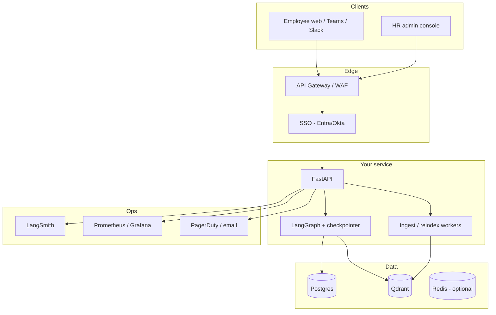

# Internal HR Policy Chatbot — Industry Roadmap

A practical plan to evolve this project from a **working backend prototype** to an **industry-ready internal HR assistant**.

Related docs: [WORKFLOW.md](WORKFLOW.md) (current architecture), [README.md](../README.md) (API reference).

---

## Where you are today

| Area              | Status                                                                    |
| ----------------- | ------------------------------------------------------------------------- |
| Core AI flow      | Strong — triage, `rag_search`, escalate, persist                          |
| HR follow-up      | Good start — list / detail / respond / resolve                            |
| Data model        | Solid — users, conversations, escalations, audit                          |
| Auth              | Weak — single `x-api-key` for everyone                                    |
| UI                | None — API/Swagger only                                                   |
| Ops               | Early — `/live` `/ready` `/health` code ready; MemorySaver default; no CI |
| Compliance / eval | Minimal — no grounding suite, no retention policy                         |

**Industry bar:** secure identity, observable ops, evaluated answers, HR workflow UX, and compliance—not just a smart API.

---

## Target architecture (production)

---

## Phased plan (recommended order)

### Phase 0 — Production baseline (2–4 weeks)

*Make what you have reliable before adding features.*

| Priority | Feature                           | Why                                                                                               |
| -------- | --------------------------------- | ------------------------------------------------------------------------------------------------- |
| P0       | **Dependency health checks**      | `/health` should verify Postgres + Qdrant + LLM config; add `/ready` vs `/live`                   |
| P0       | **Postgres checkpointer in prod** | Replace in-process `MemorySaver` so restarts don't lose multi-turn memory                         |
| P0       | **Seed + smoke tests**            | Scripted: upload policies → chat with citations → escalate → HR respond → employee sees `role=hr` |
| P0       | **CI pipeline**                   | GitHub Actions: `pytest`, `ruff`, optional integration job with Postgres                          |
| P0       | **Secrets & env**                 | Separate dev/staging/prod; no shared API key in prod                                              |

**Exit criteria:** One command deploys stack; smoke test passes; health reflects real dependencies.

**Code touchpoints:** `src/hr_chatbot/main.py`, `src/hr_chatbot/llm/checkpointer.py`, `docker-compose.yml`, new `.github/workflows/ci.yml`.

---

### Phase 1 — Security & identity (3–5 weeks)

*Biggest gap vs enterprise use.*

| Feature             | What to build                                                                        |
| ------------------- | ------------------------------------------------------------------------------------ |
| **SSO / JWT**       | Entra ID / Okta → employee identity on every chat request                            |
| **RBAC**            | Enforce `employee` vs `hr_admin` on escalation APIs (`users.role` exists, not wired) |
| **Scoped API keys** | Service accounts for integrations only; humans use SSO                               |
| **Rate limiting**   | Per-user / per-IP limits on `/chat`                                                  |
| **Audit hardening** | Who called what, when; immutable audit for escalations                               |
| **CORS lockdown**   | Replace `allow_origins=["*"]` with known front-end origins                           |

**Exit criteria:** Employees can't call HR-only endpoints; every action is attributable to a real user.

**Code touchpoints:** `src/hr_chatbot/core/security.py`, `src/hr_chatbot/api/v1/endpoints/escalations.py`, `src/hr_chatbot/main.py`.

---

### Phase 2 — Product surfaces (4–8 weeks)

*API-only won't get adoption.*

| Surface              | Features                                                                |
| -------------------- | ----------------------------------------------------------------------- |
| **Employee chat UI** | Thread history, citations panel, "escalated / waiting for HR" state     |
| **HR console**       | Escalation queue, ticket detail, reply + resolve, conversation timeline |
| **Notifications**    | Email or Teams/Slack when ticket opens or HR replies                    |
| **Policy browser**   | List policies, versions, effective dates (read-only for employees)      |

**Tech options:** React/Next.js SPA, or embed in existing intranet; HR console can be a separate route with `hr_admin` guard.

**Exit criteria:** HR never needs curl; employees get notified when HR responds.

---

### Phase 3 — RAG & answer quality (ongoing, 4–6 weeks initial)

*Trust is everything for HR.*

| Feature                  | Detail                                                                            |
| ------------------------ | --------------------------------------------------------------------------------- |
| **Grounding evaluation** | Golden set: 50–100 real HR questions + expected citations                         |
| **Refusal tests**        | Empty Qdrant, low score, sensitive topics — must refuse or escalate               |
| **Hybrid retrieval**     | BM25 + vector (e.g. Qdrant sparse or Postgres full-text) for policy numbers/dates |
| **Metadata filters**     | Region, role, employment type, policy version in Qdrant payload                   |
| **Re-ranking**           | Cross-encoder or LLM rerank top-k before answer                                   |
| **Answer confidence**    | Surface low-confidence / weak-evidence to UI ("contact HR")                       |
| **Policy versioning**    | `effective_date`, `supersedes`; retrieve only current version                     |

**Exit criteria:** Measured citation accuracy and refusal rate on a fixed eval set; regressions caught in CI.

**Code touchpoints:** `src/hr_chatbot/rag/retriever.py`, `src/hr_chatbot/llm/workflows/policy_chat/tools.py`, new `tests/eval/`.

---

### Phase 4 — HR workflow depth (4–6 weeks)

*Beyond ticket queue.*

| Feature              | Value                                                    |
| -------------------- | -------------------------------------------------------- |
| **SLA & priorities** | Due dates, P1 for conduct/medical                        |
| **Assignment**       | Route ticket to HR specialist by category                |
| **Internal notes**   | HR-only notes vs employee-visible replies                |
| **Templates**        | Canned HR responses for common escalations               |
| **Status lifecycle** | `open` → `in_progress` → `pending_employee` → `resolved` |
| **Analytics**        | Volume by category, time-to-resolve, escalation rate     |

Optional later: LangGraph `interrupt` for **draft-approve-send** (HR approves bot draft before employee sees it)—different from current post-chat HITL.

**Code touchpoints:** `src/hr_chatbot/models/escalation.py`, `src/hr_chatbot/services/escalation_service.py`, `src/hr_chatbot/api/v1/endpoints/escalations.py`.

---

### Phase 5 — Integrations (as needed)

*Fit into existing HR stack.*

| Integration                                      | Use case                                   |
| ------------------------------------------------ | ------------------------------------------ |
| **HRIS** (Workday, BambooHR)                     | Sync `employee_id`, department, manager    |
| **Teams / Slack bot**                            | Chat where employees already work          |
| **Email**                                        | Escalation alerts + async HR replies       |
| **Ticketing** (Jira Service Management, Zendesk) | Mirror escalations if HR uses another tool |
| **SharePoint / GDrive**                          | Auto-ingest policy PDFs on publish         |

---

### Phase 6 — Enterprise ops & compliance (parallel after Phase 0)

| Area               | Actions                                                                          |
| ------------------ | -------------------------------------------------------------------------------- |
| **Observability**  | LangSmith in prod + Prometheus metrics (latency, token cost, retrieval hit rate) |
| **Logging**        | Structured JSON logs; no PII in logs; correlation IDs per `thread_id`            |
| **Data retention** | Policy for message/audit retention; right-to-erasure for GDPR                    |
| **PII handling**   | Minimize storage; redact in logs; DPA with Google/Qdrant                         |
| **HA & backups**   | Postgres backups, Qdrant snapshots, multi-instance API behind load balancer      |
| **DR**             | Document RTO/RPO; restore drill                                                  |
| **Cost controls**  | Token budgets, caching frequent questions, model routing by complexity           |

---

## Feature backlog (prioritized)

### Must-have for real-world use

1. SSO + RBAC
2. Employee + HR UIs
3. Postgres checkpointer + health checks
4. Grounding evaluation suite
5. Escalation notifications
6. CI/CD + staging environment

### Should-have

1. Policy versioning and metadata filters
2. Rate limiting and abuse protection
3. HR assignment + SLA
4. Hybrid retrieval + reranking
5. Analytics dashboard

### Nice-to-have

1. Teams/Slack bot
2. HRIS sync
3. Multi-language policies
4. Voice/accessibility

---

## 90-day roadmap

| Month | Focus                    | Deliverables                                                                              |
| ----- | ------------------------ | ----------------------------------------------------------------------------------------- |
| **1** | Reliability and security | Health checks, Postgres checkpointer, CI, SSO, RBAC, staging deploy                       |
| **2** | Product and quality      | Employee chat UI, HR console, notifications, eval harness + 50 golden questions           |
| **3** | Enterprise polish        | Policy versioning, analytics, rate limits, observability dashboards, pilot with 1 HR team |

**Pilot approach:** 20–50 employees, 2 HR admins, 5–10 policies, 2-week feedback loop before company-wide rollout.

---

## What not to do early

- **Free-roaming supervisor agent** — deterministic triage routing is safer for HR
- **Custom LLM fine-tuning** — fix RAG and eval first
- **Microservices split** — monolith + workers is enough for most internal HR scale
- **Build everything before a pilot** — ship Phase 0–2 to real users quickly

---

## Success metrics (industry KPIs)

| Metric                    | Target (example)                                         |
| ------------------------- | -------------------------------------------------------- |
| Grounded answer rate      | ≥85% of safe questions cite correct policy               |
| Escalation precision      | ≥95% of high-sensitivity queries escalated, not answered |
| Time to first HR response | <24h (SLA-driven)                                        |
| Employee satisfaction     | CSAT survey post-resolution                              |
| Cost per conversation     | Track tokens + infra per thread                          |
| Uptime                    | 99.5%+ for internal tool                                 |

---

## Phase 0–1 implementation checklist

Use this as a concrete next sprint list.

### Phase 0

- [x] Extend readiness to check Postgres (`SELECT 1`) and Qdrant (`get_collections`) + LLM config
- [x] Add `/ready` (dependencies) vs `/live` (process up); `/health` aliases `/live`
- [ ] Wire `postgres_checkpointer()` in app lifespan (`main.py` + `checkpointer.py`)
- [ ] Add `scripts/smoke_test.sh` (or Python) for full chat + escalation + HITL path
- [ ] Add GitHub Actions: `uv sync`, `pytest`, `ruff check`
- [ ] Document dev/staging/prod `.env` templates (no secrets in repo)

### Phase 1

- [ ] Add JWT middleware (validate Entra/Okta token; map to `User`)
- [ ] Dependency `require_hr_admin` on escalation write endpoints
- [ ] Rate limit `/chat` (e.g. slowapi or Redis)
- [ ] Restrict CORS to known origins via settings
- [ ] Log `user_id` / `employee_id` on every audit row

---

## Summary

You have a **strong AI core** (LangGraph, RAG as a tool, escalation HITL). Industry readiness is mostly **identity, UX, evaluation, notifications, and ops**—not more agents.

Start with **Phase 0** (reliability), then **Phase 1** (security), then **Phase 2** (UI) while running a **small pilot** with real HR staff.