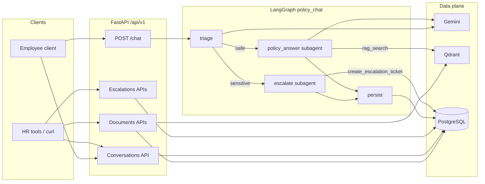
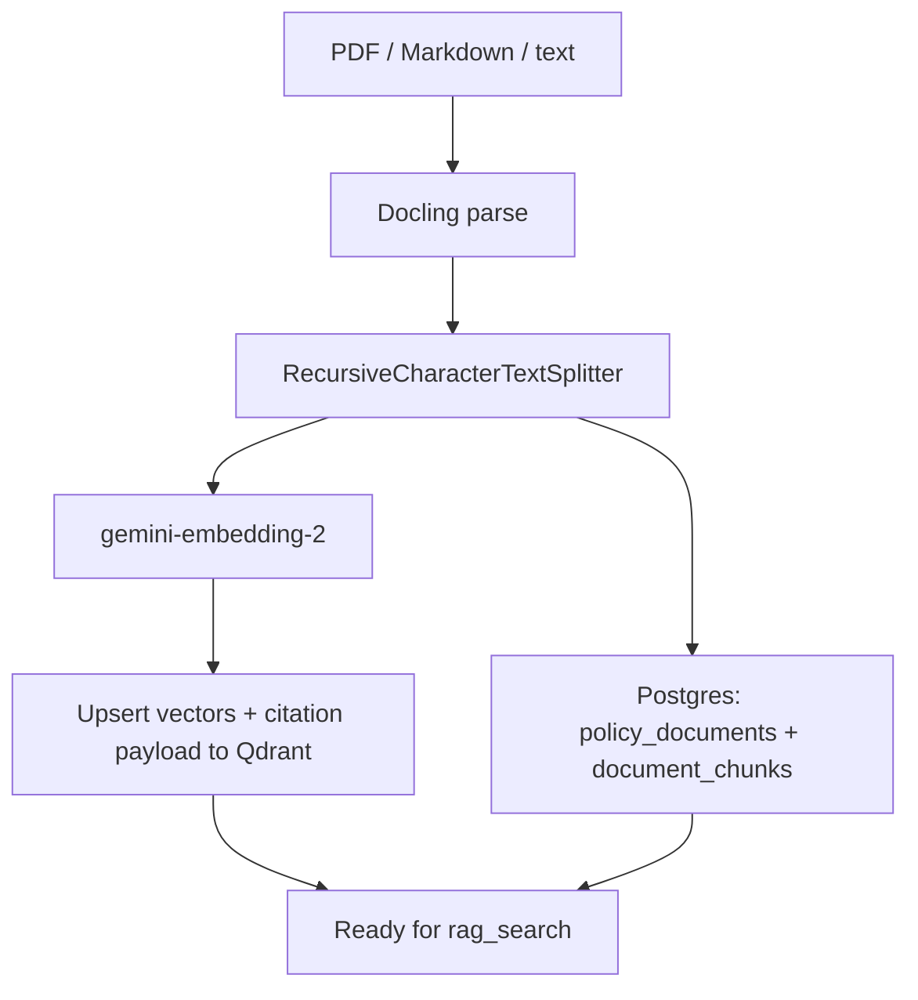
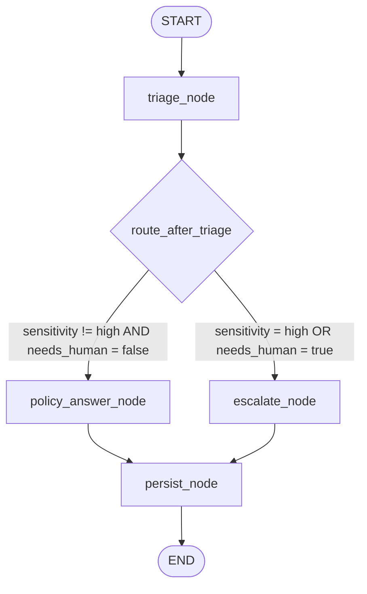
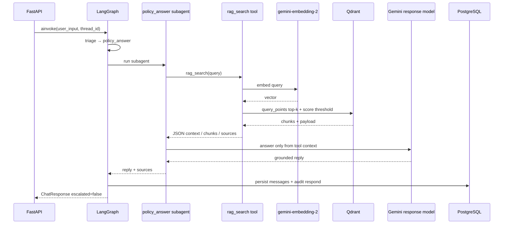
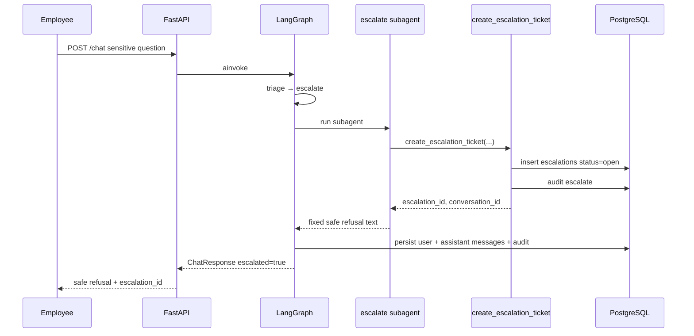
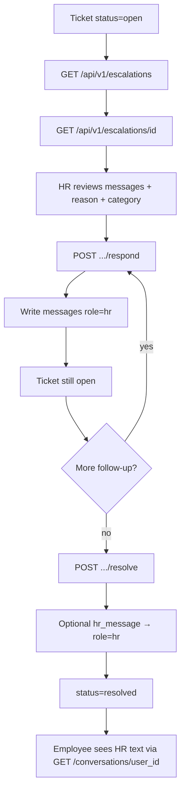
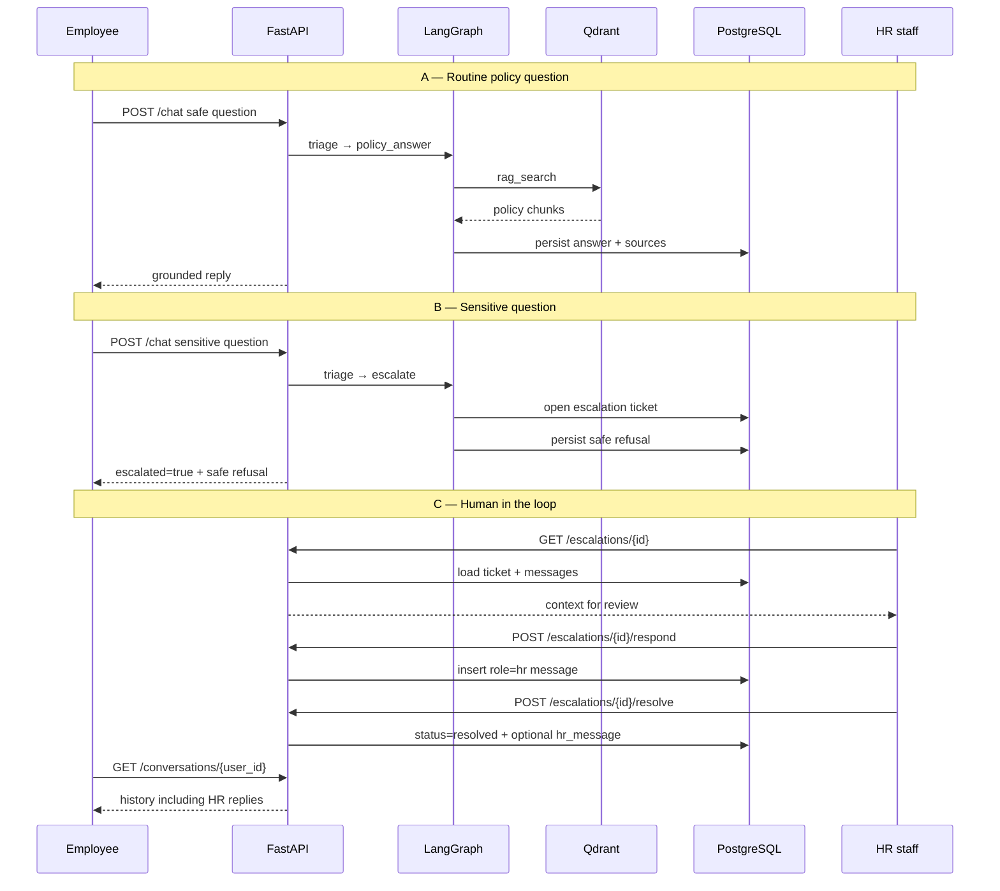
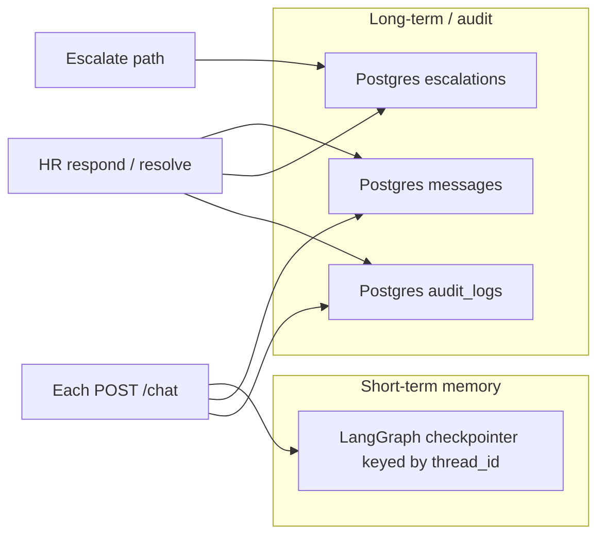

# Internal HR Policy Chatbot — End-to-End Workflow

This document explains how a request moves through the system today: ingestion,
chat (subagents + tools), and human-in-the-loop escalation.

---

## 1. Big picture

**Design rules**

- Chat is one synchronous turn: `POST /chat` always returns a reply (grounded answer or safe refusal).
- Routing is **deterministic** (structured triage + graph edges), not a free-roaming supervisor.
- RAG and ticket creation are **tools** used by subagents.
- HR follow-up is **ticket-queue HITL** after the graph ends — not a LangGraph `interrupt`.

---

## 2. Document ingestion (before chat can cite policies)

Used by `POST /api/v1/documents/upload`, reindex, and `scripts/seed_policies.py`.

Qdrant payload typically includes `text`, `document_id`, `filename`, `section`, `page_number`, `chunk_index` so answers can cite sources without a second lookup.

---

## 3. Chat turn — LangGraph topology

Entry: `POST /api/v1/chat` → compiles / invokes `policy_chat_graph` with `thread_id`.

| Node | What happens |
|---|---|
| **triage** | Gemini structured output → `TriageResult` (category, sensitivity, `needs_human`, confidence) |
| **policy_answer** | Subagent (`create_agent`) must call **`rag_search`**, then draft a grounded reply |
| **escalate** | Subagent must call **`create_escalation_ticket`**, then return fixed safe refusal |
| **persist** | Write user + assistant messages + audit row to Postgres |

State fields returned to the API include: `reply`, `sources`, `escalated`, `escalation_id`, `triage`, `conversation_id`, `thread_id`.

The HTTP body exposes the answer in **two forms**:
- `text` / `reply` — simple string for UI display
- `json` — structured object with the same reply plus sources, triage, escalation flags, and ids

---

## 4. Safe path — RAG as a tool

When triage says the question is safe:

**Fallback:** if the model skips `rag_search`, `policy_answer_node` invokes the tool directly so retrieval still happens.

---

## 5. Sensitive path — escalate then HR HITL

### 5.1 Inside the chat turn

No RAG advice is generated on this path.

### 5.2 After the ticket — human-in-the-loop

HR acts **after** the graph has already finished:

| HR action | Endpoint | Effect |
|---|---|---|
| Queue | `GET /escalations?status=open` | List open tickets |
| Review | `GET /escalations/{id}` | Ticket + conversation messages + `thread_id` / `employee_id` |
| Reply | `POST /escalations/{id}/respond` | Append `role=hr` message; keep `open` |
| Close | `POST /escalations/{id}/resolve` | Mark `resolved`; optional final `hr_message` |

Audit events: `hr_respond`, `hr_resolve`.

---

## 6. Full lifecycle (employee + HR)

---

## 7. Memory and persistence

- Reuse the same `thread_id` for multi-turn chatbot memory.
- Clean Human / AI / HR text lives in `messages` (independent of checkpoint blobs — ADR-001).

---

## 8. Auth and surfaces

| Surface | Auth | Purpose |
|---|---|---|
| `POST /api/v1/chat` | `x-api-key` | Employee question |
| `GET/POST /api/v1/documents/*` | `x-api-key` | Policy ingest / list / reindex |
| `GET /api/v1/conversations/{user_id}` | `x-api-key` | History (includes `role=hr`) |
| `GET/POST /api/v1/escalations/*` | `x-api-key` | HR queue + HITL actions |
| `GET /health` | public | Liveness (alias of `/live`) |
| `GET /live` | public | Liveness — process up |
| `GET /ready` | public | Readiness — Postgres + Qdrant + LLM config |

There is no separate HR UI in-repo; HR tools call the escalations API (or curl).

---

## 9. Code map (where to look)

| Area | Path |
|---|---|
| Chat endpoint | `src/hr_chatbot/api/v1/endpoints/policy_chat.py` |
| Graph wiring | `src/hr_chatbot/llm/workflows/policy_chat/graph.py` |
| Nodes | `src/hr_chatbot/llm/workflows/policy_chat/nodes.py` |
| Subagents | `src/hr_chatbot/llm/workflows/policy_chat/agents.py` |
| Tools (`rag_search`, ticket) | `src/hr_chatbot/llm/workflows/policy_chat/tools.py` |
| Escalation HITL service | `src/hr_chatbot/services/escalation_service.py` |
| Escalation APIs | `src/hr_chatbot/api/v1/endpoints/escalations.py` |
| Retriever | `src/hr_chatbot/rag/retriever.py` |
| Ingestion | `src/hr_chatbot/rag/ingestion.py` |

---

## 10. One-line summary

**Ingest policies → chat triages → safe questions use `rag_search` for grounded answers → sensitive questions open a ticket and refuse automation → HR reviews/replies/resolves via escalations APIs → employees see HR messages in conversation history.**
